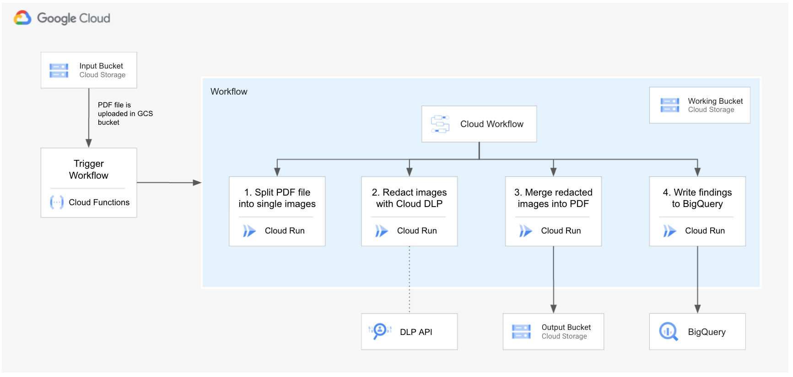

# Solution Guide
This solution provides an automated, serverless way to redact sensitive data from PDF files using Google Cloud Services like [Data Loss Prevention (DLP)](https://cloud.google.com/dlp), [Cloud Workflows](https://cloud.google.com/workflows), and [Cloud Run](https://cloud.google.com/run).


## Solution Architecture Diagram
The image below describes the solution architecture of the pdf redaction process.



## Workflow Steps
The workflow consists of the following steps:
1. The user uploads a PDF file to a GCS bucket
1. A Workflow is triggered by [EventArc](https://cloud.google.com/eventarc/docs). This workflow orchestrates the PDF file redaction consisting of the following steps:
    - Split the PDF into single pages, convert pages into images, and store them in a working bucket
    - Redact each image using DLP Image Redact API
    - Assemble back the PDF file from the list of redacted images and store it on GCS (output bucket)
    - Write redacted quotes (findings) to BigQuery

# Deploy PDF Redaction app
The `terraform` folder contains the code needed to deploy the PDF Redaction application.

## What resources are created?
Main resources:
- Workflow
- CloudRun services for each component with its service accounts and permissions
  1. `pdf-spliter` - Split PDF into single-page image files
  1. `dlp-runner` - Runs each page file through DLP to redact sensitive information
  1. `pdf-merger` - Assembles back the pages into a single PDF
  1. `findings-writer` - Writes findings into BigQuery
- Cloud Storage buckets
  - *Input Bucket* - bucket where the original file is stored
  - *Working Bucket* - a working bucket in which all temp files will be stored as throughout the different workflow stages
  - *Output Bucket* - bucket where the redacted file is stored
- DLP template where InfoTypes and rules are specified. You can modify the `dlp.tf` file to specify your own INFO_TYPES and Rule Sets (refer to [terraform documentation for dlp templates](https://registry.terraform.io/providers/hashicorp/google/latest/docs/resources/data_loss_prevention_inspect_template))
- BigQuery dataset and table where findings will be written

## How to deploy?
The following steps should be executed in Cloud Shell in the Google Cloud Console. 

### 1. Create a project and enable billing
Follow the steps in [this guide](https://cloud.google.com/resource-manager/docs/creating-managing-projects).

### 2. Get the code
Clone this github repository go to the root of the repository.

``` 
git clone https://github.com/GoogleCloudPlatform/dlp-pdf-redaction
cd dlp-pdf-redaction
```

### 3. Build images for Cloud Run
You will first need to build the docker images for each microservice.

```
PROJECT_ID=[YOUR_PROJECT_ID]
gcloud services enable cloudbuild.googleapis.com containerregistry.googleapis.com --project $PROJECT_ID
gcloud builds submit --config ./build-app-images.yaml --project $PROJECT_ID
```
Note: If you receive a pop-up for permissions, you can authorize gcloud to request your credentials an make a GCP API call.


The above command will build 4 docker images and push them into Google Container Registry (GCR). Run the following command and confirm that the images are present in GCR.

```
gcloud container images list --project $PROJECT_ID
```

### 4. Deploy the infrastructure using Terraform

This terraform deployment requires the following variables. 

- project_id            = "YOUR_PROJECT_ID"
- region                = "YOUR_REGION_REGION"
- wf_region             = "YOUR_WORKFLOW_REGION"

From the root folder of this repo, run the following commands:
```
export TF_VAR_project_id=$PROJECT_ID
terraform -chdir=terraform init
terraform -chdir=terraform apply -auto-approve
```

**Note:** Region and Workflow region both default to `us-central1`. If you wish to deploy the resources in a different region, specify the `region` and the `wf_region` variables (ie. using `TF_VAR_region` and `TF_VAR_wf_region`). Cloud Workflows is only available in specific regions, for more information check the [documentation](https://cloud.google.com/workflows/docs/locations).

### 5. Take note of Terraform Outputs

Once terraform finishes provisioning all resources, you will see its outputs. Please take note of `input_bucket` and `output_bucket` buckets. Files uploaded to the `input_bucket` bucket will be automatically processed and the redacted files will be written to the `output_bucket` bucket.
If you missed the outputs from the firs run, you can list the outputs by running

```
terraform -chdir=terraform output
```

### 6. Test

Use the command below to upload the test file into the `input_bucket`. After a few seconds, you should see a redacted PDF file in the `output_bucket`.
```
gsutil cp ./test_file.pdf [INPUT_BUCKET_FROM_OUTPUT e.g. gs://pdf-input-bucket-xxxx]
```

If you are curious about the behind the scenes, try:
- Checkout the Redacted file in the `output_bucket`.

  ```
  gsutil ls [OUTPUT_BUCKET_FROM_OUTPUT e.g. gs://pdf-output-bucket-xxxx]
  ```

- Download the redacted pdf file, open it with your preferred pdf reader, and search for text in the PDF file.
- Looking into [Cloud Workflows](https://console.cloud.google.com/workflows) in the GCP web console. You will see that a workflow execution was triggered when you uploaded the file to GCS.
- Explore the `pdf_redaction_xxxx` dataset in BigQuery and check out the metadata that was inserted into the `findings` table.

